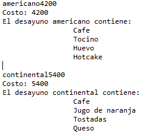
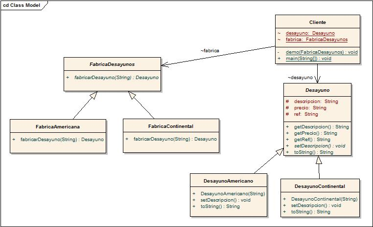

# Modelos de Programacion II. Ejercicio de practica con principio..

Integrantes: 

Jose Manuel Ferreira Benavides - 20161020012  
Juan Sebastian Reyes - 20142020091

Ejemplifica el uso de patrones.

Conforme con:

Polimorfismo  
  Se logra en la medida que con una referencia FabricaDesayuno intercambiamos entre los comportamientos de FabricaContinental y             FabricaAmericana.

Inversión de dependencia
  Satisfecho en la medida que el cliente se trabaja/conoce la interface y no las implementaciones.
  
Sustitución de Liskov
  Dado que toda subclase ha sido diseñanda siguiendo la interface, esto se cumple. Cabe mencionar que el mismo compilador dificulta romper    este principio.

Abierto-Cerrado
  Sigue abierto-cerrrado en la medida que podemos agregar nuevas fabricas efectivamente agregando nuevos tipos de desayuno soportados sobre la misma interface. La adicion de una logica diferente con la cual se modifique el modo con el que las fabricas ya implementadas crean los productos es posible haciendo uso de un decorador si se quiere seguir fuertemente O/C. La modificacion de la estructura sobre la cual definimos los Desayunos tambien es posible creando nuevas subclases de "Desayuno".
  
Factoria (En esta implementación es Factory Method)
  Se trabaja con una Fabrica abstracta "FabricaDesayuno" que define el metodo fabrica "fabricarDesayuno" cuya implementacion es postergada o delegada a las subclases FabricaContinental y FabricaAmericana.

Posible salida del programa con una demostracion con precios aleatorios. No hay user input.

------ Diagrama de clase ---------

